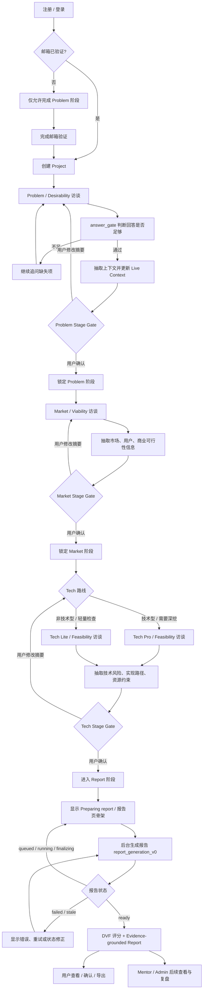
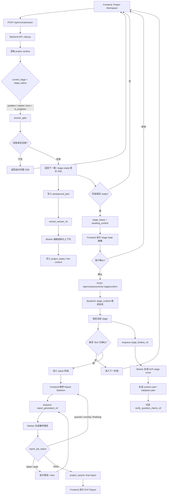
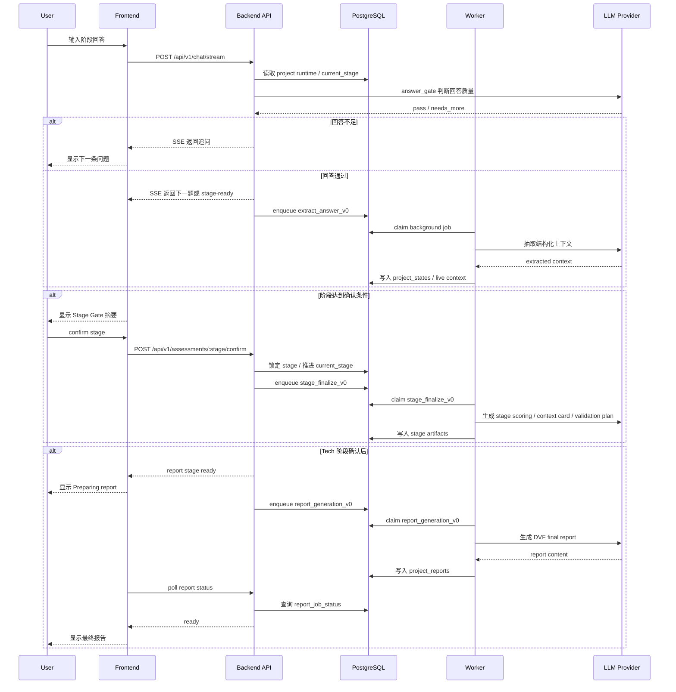

# Deep Dive: Product And System Flowcharts

## 一句话结论
这份文档保存 IdeaSense AI 的产品主链路和工程执行链路。图表使用 Mermaid 编写，适合在 GitHub、Markdown 编辑器或文档站中直接渲染。

## Mermaid 写法速记
- `flowchart TD`: 从上到下排版。
- `A[普通步骤]`: 矩形步骤节点。
- `B{判断条件}`: 菱形判断节点。
- `A --> B`: 普通箭头。
- `A -- 条件 --> B`: 带条件说明的箭头。
- `sequenceDiagram`: 时序图，用于展示前端、后端、数据库、worker 和 LLM 的调用顺序。

## 产品主链路
这张图用于解释用户视角的核心流程：项目创建、分阶段访谈、上下文抽取、Stage Gate 确认、DVF 评分和最终报告。

## 工程执行链路
这张图用于解释系统视角的状态机和后台任务边界：哪些步骤在 API 可见路径中完成，哪些步骤进入 `background_jobs` 由 worker 处理。

## 工程时序图
这张图用于解释前端、API、数据库、worker 和 LLM provider 的调用顺序。它更适合工程评审、架构讲解和后续排查等待链路。

## 使用边界
- 产品说明优先使用“产品主链路”。
- 架构说明优先使用“工程执行链路”。
- 工程评审、排查慢请求、说明同步/异步边界时优先使用“工程时序图”。
- 图表中的报告 ready 不等于按钮被点击成功；它应对应当前 context version 下的 final `project_reports` artifact。
